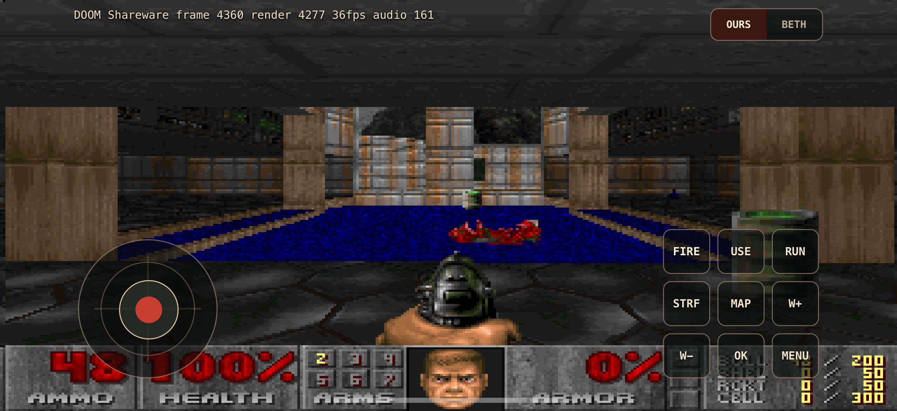

# React Native Doom



React Native Doom is an iOS-first React Native prototype that renders Doom frames through a native Nitro bridge and displays them with React Native Skia. It includes full Doom sound playback support through React Native Audio API.

## License

This repository's original source code is licensed under the MIT License. Local Doom engine sources and IWAD game data are intentionally not included in this repository and are not covered by this project's MIT License.

## Local Doom Files

Add the local runtime files yourself before building:

```text
third_party/doomgeneric/
  doomgeneric/
    doomgeneric.c
    doomgeneric.h
    ...

assets/doom/
  DOOM1.WAD
```

Use only engine source and IWAD files that you are allowed to use and redistribute under their own terms. Do not commit these files.

Check the expected local layout:

```sh
npm run check:doom-files
```

## Setup

Install JavaScript dependencies:

```sh
npm install
```

Install iOS pods after adding the local Doom files:

```sh
cd ios
bundle install
bundle exec pod install
cd ..
```

Run Metro:

```sh
npm start
```

Build and launch on an available iOS simulator:

```sh
npm run ios
```

## Development

Useful checks:

```sh
npx tsc --noEmit
npm run lint
npm test -- --runInBand --no-watchman
```

The main React Native UI lives in `App.tsx`. JS bridge wrappers are in `src/doom/`, and the native iOS bridge is in `cpp/doom_engine/` plus `ios/ReactNativeDoomEngine/`.
